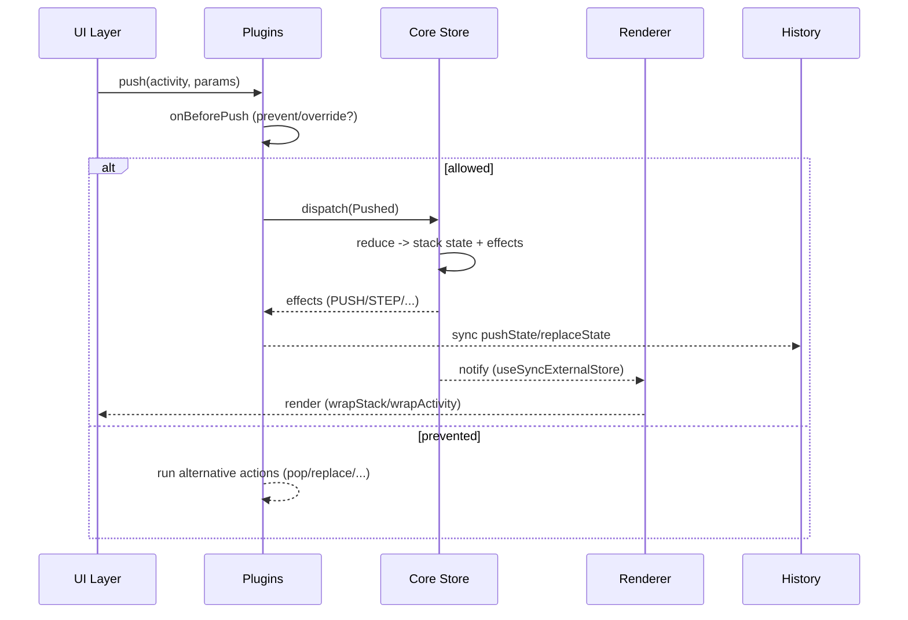

# Stackflow Deep‑Dive: Architectural Notes & Recipes

> 기반: [https://github.com/daangn/stackflow](https://github.com/daangn/stackflow) 리포지토리를 GPT가 정리·분석한 내용. 실제 API/동작은 버전에 따라 달라질 수 있으니, 구현 전 최신 소스/문서를 교차 확인하세요.

---

## 목차

* [개요](#개요)
* [전체 실행 흐름](#전체-실행-흐름)
* [1. 코어 이벤트 파이프라인](#1-코어-이벤트-파이프라인)

  * [이벤트 집계 & 유효성](#이벤트-집계--유효성)
  * [스택/액티비티/스텝 상태 모델](#스택액티비티스텝-상태-모델)
  * [리듀서 계층](#리듀서-계층)
  * [글로벌 전환 상태와 효과(Effects)](#글로벌-전환-상태와-효과effects)
* [2. 코어 스토어 & 플러그인 라이프사이클](#2-코어-스토어--플러그인-라이프사이클)

  * [스토어 재계산 & 폴링](#스토어-재계산--폴링)
  * [액션 생성기 & 사전 훅](#액션-생성기--사전-훅)
  * [플러그인 훅 표면](#플러그인-훅-표면)
* [3. React 안정화 계층(@stackflow/react/stable)](#3-react-안정화-계층stackflowreactstable)

  * [팩토리 & 반환물](#팩토리--반환물)
  * [렌더링 파이프라인](#렌더링-파이프라인)
  * [액션 훅과 전환 상태](#액션-훅과-전환-상태)
* [4. React 2.0 미리보기(@stackflow/react/future)](#4-react-20-미리보기stackflowreactfuture)

  * [설정 & 로더 캐시](#설정--로더-캐시)
  * [지연 로딩 & 구조화 컴포넌트](#지연-로딩--구조화-컴포넌트)
  * [프리페치 훅](#프리페치-훅)
* [5. UI & 렌더러](#5-ui--렌더러)

  * [기본 UI 플러그인](#기본-ui-플러그인)
  * [렌더러 플러그인 비교](#렌더러-플러그인-비교)
* [6. 공식 플러그인 & 확장](#6-공식-플러그인--확장)
* [7. 실전 레시피](#7-실전-레시피)

  * [7.1 페이지 애니메이션 커스터마이징](#71-페이지-애니메이션-커스터마이징)
  * [7.2 Android FLAG 패턴식 스택 제어 (플러그인 + per-call 옵션)](#72-android-flag-패턴식-스택-제어-플러그인--per-call-옵션)
  * [7.3 모달/스텝 + 히스토리 통합 관리](#73-모달스텝--히스토리-통합-관리)
* [8. 테스트 & 디버깅](#8-테스트--디버깅)
* [9. 타입/ DX 팁](#9-타입-dx-팁)
* [10. 주의사항 & 함정](#10-주의사항--함정)
* [부록 A: 시퀀스 다이어그램](#부록-a-시퀀스-다이어그램)
* [부록 B: 최소 예시 스니펫](#부록-b-최소-예시-스니펫)

---

## 개요

Stackflow는 **이벤트 소싱** 기반의 코어 위에 **플러그인 체계**와 **React 통합층**, 그리고 **UI/히스토리/데이터 로딩** 확장을 얹어 **모바일 앱/웹뷰 스타일 스택 내비게이션**을 제공합니다.

핵심 아이디어는 다음과 같습니다.

* **이벤트 로그**를 단일 소스로 삼아 정렬·중복 제거·유효성 검사 → **리듀서**로 스택 상태 구축
* **플러그인 훅**으로 행동 사전/사후 가로채기, 초기 이벤트 재정의, 스택 변경 관찰
* **React 계층**에서 `<Stack />`/훅/렌더러 플러그인으로 실제 UI 연결
* **UI/History/Preload** 등은 공식 플러그인으로 제공하며, 필요한 경우 **커스텀 렌더러/플러그인** 작성 가능

## 전체 실행 흐름

1. **이벤트 수집** → 2) **코어 스택 연산**(리듀서/효과) → 3) **플러그인 후처리** → 4) **React 렌더링** → 5) **UI/히스토리/프리로드 동기화**

---

## 1. 코어 이벤트 파이프라인

### 이벤트 집계 & 유효성

* 들어온 도메인 이벤트를 **ID 기준으로 정렬/중복 제거**.
* **유효성 검사**: `Initialized` 단일성, **등록된 액티비티만** `Pushed` 허용 등.
* 이후 **스택 리듀서** 실행, 후처리로 **z-index/루트/최상단** 계산.

### 스택/액티비티/스텝 상태 모델

* **스택 상태**: 액티비티 배열 + 각 액티비티의 **스텝 스택**.
* 각 항목은 다음 메타를 보존:

  * 진입/이탈 플래그, 최상단 여부, 루트 여부, z-index
  * 진입/이탈을 유발한 **이벤트 레퍼런스**, 파라미터 스냅샷
* 스텝은 **단계형 내비게이션**을 위한 서브 스택이며, 오버레이 레이어(모달 등) 표현을 위해 z-index 누적을 지원.

### 리듀서 계층

* **`makeStackReducer`**: 등록/일시중지/재개 처리, 단계 이벤트 대상 액티비티 탐색, **전역 전환 상태**(idle/loading/paused) 계산.
* **`makeActivitiesReducer`**: `Pushed`/`Replaced` 시 새 액티비티 삽입, 전환 완료 여부에 따라 `enter-active/enter-done` 등 상태 전개.
* **`makeActivityReducer`**: `Popped`에서 스텝 스택 정리, `StepPushed/StepReplaced/StepPopped`로 **스텝 목록 및 파라미터 갱신**.

### 글로벌 전환 상태와 효과(Effects)

* 코어는 이벤트 처리 결과로 **효과 리스트**를 생성(예: PUSH/REPLACE/POP, STEP, PAUSED/RESUMED 등 태그).
* 플러그인은 이 **효과**를 후속 훅에서 받아 사이드 이펙트(로그, 히스토리 동기화, 분석 전송)를 실행.

---

## 2. 코어 스토어 & 플러그인 라이프사이클

### 스토어 재계산 & 폴링

* `makeCoreStore`는 **이벤트 로그**를 보관. 초기 이벤트는 **플러그인이 덮어쓰기** 가능.
* 새 이벤트 도착 시 **즉시 상태 재계산** 후, **전환 중**에는 애니메이션 완료까지 **\~60fps 주기 폴링**으로 상태 반영.

### 액션 생성기 & 사전 훅

* 액션 생성기는 디스패치 전에 **모든 플러그인의 사전 훅** 호출.

  * `preventDefault()` 및 **파라미터 덮어쓰기**(override)를 허용.
  * 거부되지 않으면 이벤트를 생성해 코어에 전달.

### 플러그인 훅 표면

* 대표 훅(예시):

  * `onBeforePush/Replace/Pop/StepPush/...`
  * `onPushed/Replaced/Popped/Changed/...`
  * `overrideInitialEvents`
  * `wrapStack/wrapActivity`(React 렌더러 계층에서 컨텍스트/레이아웃 주입)

---

## 3. React 안정화 계층(@stackflow/react/stable)

### 팩토리 & 반환물

* `stackflow()`는 선언형 옵션을 받아 **정적 코어 스토어**를 준비.

  * 브라우저에서는 단일 스토어 **재사용**(싱글톤).
  * **액티비티 등록 이벤트**와 선택적 **초기 액티비티**를 미리 주입.
  * 플러그인 배열을 평탄화하여 **실행 인스턴스** 구성.
* 반환물: `<Stack />`, `useFlow()/useStepFlow()`, **동적 액티비티/플러그인 추가**, **원시 액션 접근자**.

### 렌더링 파이프라인

* `<Stack />` → `CoreProvider`(스토어) & `PluginsProvider`(플러그인) 공급.
* `MainRenderer`가 **렌더링 플러그인**을 찾아 실행. 없으면 경고.
* 각 플러그인은 `wrapStack/wrapActivity`로 자체 컨텍스트/레이아웃 주입 가능.

### 액션 훅과 전환 상태

* `useActions()`는 타입 안전한 `push/replace/pop` 제공.
* 애니메이션 옵션은 `skipEnterActiveState/skipExitActiveState`로 매핑되어 코어로 전달.
* `useTransition()`은 전환 진행 여부를 노출.

---

## 4. React 2.0 미리보기(@stackflow/react/future)

### 설정 & 로더 캐시

* `defineConfig()` + 액티비티 컴포넌트 맵 입력.
* 항상 `loaderPlugin` 주입. **데이터 로더**는 동일 파라미터 **캐시/만료**.
* 로딩 중에는 `pause()/resume()`으로 **전환 중단/재개**.

### 지연 로딩 & 구조화 컴포넌트

* `lazy()`는 지연 로딩된 컴포넌트를 **캐시**(재호출 시 재다운로드 방지).
* `StructuredActivityComponent`: 콘텐츠/레이아웃/로딩/에러 **분리 선언**.
* `PluginRenderer`가 로딩 시 **Suspense**, 에러 시 **경계**, 레이아웃을 자동 감쌈.

### 프리페치 훅

* `usePrepare()`가 설정/로더/컴포넌트 맵으로 **데이터·지연 컴포넌트 선행 로드**.
* `useLoaderData()`, `useActivityPreloadRef()`로 액티비티 컨텍스트에서 로더 결과 접근.

---

## 5. UI & 렌더러

### 기본 UI 플러그인

* `@stackflow/plugin-basic-ui`는 **전역 CSS 변수 기반 테마** 제공.
* `<Stack />`을 감싸 **공통 옵션 주입**. `AppScreen`은:

  * 테마별 **z-index 계산**, **스와이프 백 제스처**, **전환 오프셋**
  * AppBar/Dim 레이어 렌더링, 터치 차단 처리 등.

### 렌더러 플러그인 비교

* `@stackflow/plugin-renderer-basic`: **exit 완료된 액티비티**만 제외하고 모두 렌더(전환 중 겹침 표현 용이).
* `@stackflow/plugin-renderer-web`: **활성 액티비티만** 렌더(웹 뷰 경량 구성).

---

## 6. 공식 플러그인 & 확장

* **History Sync**: 라우트 정의 정규화 → 초기 URL 기반 `Pushed/StepPushed` 재구성 + 기본 히스토리 스택 삽입. `popstate` 감시로 코어 이벤트 동기화. 스택 변화 시 `pushState/replaceState` 반영.
* **Link**: 라우트 템플릿으로 `href` 계산. 뷰포트 진입 시 `preload()`, 클릭을 `push/replace`로 전환.
* **Preload**: 액티비티 프리로더 등록. 초기/사전 내비게이션 데이터 로드 → `activityContext.preloadRef` 전달. `usePreloader()/useActivityPreloadRef()` 제공.
* **초기 액티비티 매핑**: URL 커스텀 파싱으로 첫 `Pushed` 덮어쓰기(딥링크 처리).
* **스택 깊이 감시**: 활성 액티비티 수 추적 → 초기화/변경 시 콜백(로그/분석 등).
* **Devtools**: 이벤트/효과 로그 & 현재 스택을 `window.__STACKFLOW_DEVTOOLS__`에 저장, 변경 시 브로드캐스트.
* **Google Analytics 4**: 전환 시 GA4 pageview 전송(이벤트/사용자 설정 주입).
* **Compat await push**: 액티비티 ID별 Promise resolve 콜백 관리로 레거시 await 패턴 유지.

---

## 7. 실전 레시피

### 7.1 페이지 애니메이션 커스터마이징

#### 목표

* 기본 전환 시간을 통일하거나 화면별로 전환을 생략/가속.
* 테마/디밍/오프셋 등 스타일을 프로젝트 톤에 맞춤.

#### 방법 A: CSS 변수 오버라이드(기본 UI 플러그인)

```css
:root {
  /* 실제 변수명은 버전에 따라 다를 수 있음: 플러그인 CSS를 확인하세요 */
  --sf-transition-duration: 240ms;  /* 전환 시간 */
  --sf-dim-opacity: 0.28;           /* 디밍 강도 */
  --sf-appbar-height: 48px;         /* 앱바 높이 */
}
```

#### 방법 B: 액션 옵션으로 전환 스킵

```ts
const { push, replace, pop } = useActions();

// 특정 이동만 즉시 완료 (엔터/엑싯 스킵)
push("Detail", params, {
  skipEnterActiveState: true,
});

replace("Home", {}, { skipExitActiveState: true });
```

#### 방법 C: 커스텀 렌더러 작성

* `plugin-renderer-basic`를 참고하여 **자체 렌더러**를 만들고 `wrapActivity`에서 컨테이너에 **전환 클래스/인라인 스타일**을 주입.
* 전환 진행도는 스택 상태(진입/이탈/활성 플래그, z-index)를 근거로 계산.

### 7.2 Android FLAG 패턴식 스택 제어 (플러그인 + per-call 옵션)

#### 목적

* **전역 규칙은 플러그인**으로 가로채고, \*\*호출부 의도는 `push()` 3번째 인자(options)\*\*로 전달해 오버라이드.
* 호출부는 `useActions().push(name, params, { navFlags })` 형태만 사용하고, **판단 로직은 전부 플러그인**에 둡니다.

#### 타입 정의 (앱 공유 타입)

```ts
export type NavFlag =
  | { type: "SINGLE_TOP" }
  | { type: "CLEAR_TOP"; target: string }
  | { type: "JUMP_TO"; to: string }
  | { type: "CLEAR_TASK" };

export type PushOptionsExt = Parameters<ReturnType<typeof useActions>["push"]>[2] & {
  navFlags?: NavFlag[];
};
```

#### 플러그인 구현: onBeforePush에서 navFlags 해석

```ts
import type { StackflowPlugin } from "@stackflow/core";

export const navFlagPlugin = (): StackflowPlugin => ({
  name: "nav-flag-plugin",
  onBeforePush({ action, preventDefault, actions }) {
    // 1) per-call 옵션에서 navFlags 읽기 (권장 경로)
    const flags = (action as any).options?.navFlags as NavFlag[] | undefined;

    // 2) 호환: 옵션이 액션에 보존되지 않는 버전일 경우, params 예약 키로 전달한 것을 읽는 대안
    const fallbackFlags = !(flags && flags.length)
      ? (action.params as any)?.__nav as NavFlag[] | undefined
      : undefined;

    const useFlags = flags?.length ? flags : (fallbackFlags ?? []);
    if (!useFlags.length) return;

    // 원본 push 취소 후, 플래그에 따라 대체 시퀀스 실행
    preventDefault();

    const stack = actions.getStack();
    const top = stack.activities.at(-1);

    // 1) JUMP_TO: 목적지로 바로 전환 의도 → 이후 규칙과 조합 가능
    const jump = useFlags.find((f): f is Extract<NavFlag, { type: "JUMP_TO" }> => f.type === "JUMP_TO");
    const targetName = jump ? jump.to : action.activityName;

    // 2) CLEAR_TASK: 전체 초기화
    if (useFlags.some(f => f.type === "CLEAR_TASK")) {
      for (let i = stack.activities.length - 1; i >= 0; i--) actions.pop();
      actions.push(targetName, action.params, (action as any).options);
      return;
    }

    // 3) SINGLE_TOP: 최상단이 동일하면 새 push 대신 replace
    if (useFlags.some(f => f.type === "SINGLE_TOP") && top?.name === targetName) {
      actions.replace(targetName, action.params, (action as any).options);
      return;
    }

    // 4) CLEAR_TOP: 특정 대상까지 비우고 replace
    const ct = useFlags.find((f): f is Extract<NavFlag, { type: "CLEAR_TOP" }> => f.type === "CLEAR_TOP");
    if (ct) {
      const idx = stack.activities.findIndex(a => a.name === ct.target);
      if (idx >= 0) {
        for (let i = stack.activities.length - 1; i > idx; i--) actions.pop();
        actions.replace(ct.target, action.params, (action as any).options);
        return;
      }
    }

    // 기본: 목적지로 push
    actions.push(targetName, action.params, (action as any).options);
  },
});
```

> 권장: 위 플러그인을 전역으로 등록하고, **호출부는 판단 없이 navFlags만 전달**하세요. 코어가 `action.options`를 보존하지 않는 구버전일 경우, `params.__nav`를 읽는 **fallback** 로직처럼 예약 키를 쓰되, `overrideActionParams()`로 최종 전달 params에서 제거하세요.

#### 사용 예시 (호출부는 옵션만 지정)

```ts
const { push } = useActions();

push("Page7", { id: 123 }, {
  navFlags: [
    { type: "JUMP_TO", to: "Page4" },
    { type: "CLEAR_TOP", target: "Page4" },
    { type: "SINGLE_TOP" },
  ],
});
```

#### 플러그인 등록 예시

```ts
const { Stack } = stackflow({
  activities: { Home, Page4, Page7 },
  plugins: [
    basicUIPlugin({}),
    rendererBasicPlugin(),
    historySyncPlugin({ /* routes */ }),
    navFlagPlugin(), // ← 여기서 전역 등록
  ],
});
```

#### 운영 팁

* **우선순위**(권장): `JUMP_TO` → `SINGLE_TOP` → `CLEAR_TOP` → `CLEAR_TASK`.
* **History 연동**: `onBeforePop`에서 모달/스텝 우선 닫기 정책과 함께 구성.
* **테스트 케이스**: (A) 동일 최상단 + SINGLE\_TOP, (B) 중간에 target 존재 + CLEAR\_TOP, (C) 전부 비우기 + CLEAR\_TASK, (D) JUMP\_TO와 조합.

### 7.3 모달/스텝 + 히스토리 통합 관리

#### 목표

* 모달을 **스텝**(혹은 별도 액티비티)으로 쌓고, **브라우저 히스토리**와 동기화.
* 백버튼이 우선 **모달 닫기** → 더 이상 모달이 없을 때 액티비티 pop.

#### 설계 아이디어

* **모달을 스텝**으로 모델링: `stepPush({ kind: "modal", modal: "SheetA" }, { hasZIndex: true })`
* 모달 닫기: `stepPop()` → 없으면 `pop()`
* **History Sync**를 참고해 `onStepPushed/StepPopped`에서 `pushState/replaceState`를 업데이트.
* URL 스키마 예: `/inbox?modal=sheetA` or `/inbox#modal=sheetA`

#### 플러그인 스켈레톤

```ts
export const modalHistoryPlugin = (): StackflowPlugin => ({
  name: "modal-history-plugin",

  onBeforePop({ actions, preventDefault }) {
    const stack = actions.getStack();
    const top = stack.activities.at(-1);
    const hasModal = top?.steps?.some(s => s.params?.kind === "modal");
    if (hasModal) {
      preventDefault();
      actions.stepPop(); // 먼저 모달 닫기
      history.back();    // URL도 한 단계 되돌림(스키마에 맞게 조정)
    }
  },

  onStepPushed({ action }) {
    const step = action.params;
    if (step?.kind === "modal") {
      const url = new URL(location.href);
      url.searchParams.set("modal", String(step.modal));
      history.pushState(null, "", url);
    }
  },

  onStepPopped() {
    const url = new URL(location.href);
    url.searchParams.delete("modal");
    history.replaceState(null, "", url);
  },
});
```

> 고급화: **다중 모달 스택**(BottomSheet→Dialog 등) 지원, **딥링크**로 모달 초기 진입, **전환 중 재진입 방지**(pause/resume) 연동.

---

## 8. 테스트 & 디버깅

* **Devtools 플러그인** 활성화 → `window.__STACKFLOW_DEVTOOLS__`에서 **이벤트/효과/스택 스냅샷** 확인.
* **불변성/유효성** 인variants: `Initialized` 단일성, **등록되지 않은 액티비티 금지**, **이탈 완료 액티비티 렌더 제외** 등.
* **시나리오 테스트**: push→stepPush→stepPop→pop, 히스토리 `popstate` 동기화, 전환 중 pause/resume.

## 9. 타입/ DX 팁

* `defineConfig()` + `loader()` 헬퍼로 **파라미터/로더 타입 추론**을 극대화.
* `useActions()/useStepActions()` 반환 타입을 **export**하여 앱 레이어에서 재사용.
* 액티비티/스텝 파라미터 업데이트는 **함수형 패턴**으로 안전하게.

## 10. 주의사항 & 함정

* **이벤트 ID 중복**은 집계 단계에서 제거됨 → 커스텀 이벤트 생성 시 **고유성 보장** 필요.
* **pause/resume** 중 액션 재진입: 큐잉/재생산 타이밍에 주의.
* **SSR/CSR 혼합**: 브라우저에서는 스토어 **싱글톤 재사용**됨. 초기 이벤트 주입 순서에 주의.
* **플러그인 순서**는 중요(사전 훅 체인). 상호 의존 플러그인은 하나로 합치는 편이 안전.
* `renderer-web`은 **활성 화면만** 렌더 → 오버레이/겹침 표현이 필요한 경우 `renderer-basic` 또는 커스텀 렌더러 사용.

---

## 부록 A: 시퀀스 다이어그램



## 부록 B: 최소 예시 스니펫

```ts
import { stackflow } from "@stackflow/react";
import { basicUIPlugin } from "@stackflow/plugin-basic-ui";
import { rendererBasicPlugin } from "@stackflow/plugin-renderer-basic";
import { historySyncPlugin } from "@stackflow/plugin-history-sync";
import { navFlagPlugin, NavFlag } from "./navFlagPlugin"; // ← 플러그인 분리 구현

// stackflow 초기화
const { Stack, useActions } = stackflow({
  activities: {
    Home: HomeActivity,
    Page4: Page4,
    Page7: Page7,
  },
  plugins: [
    basicUIPlugin({}),
    rendererBasicPlugin(),
    historySyncPlugin({ /* routes */ }),
    navFlagPlugin(), // FLAG 패턴 플러그인 전역 등록
  ],
});

export default function App() {
  return <Stack/>;
}

function SomeButton() {
  const { push } = useActions();
  return (
    <button
      onClick={() =>
        push("Page7", { id: 123 }, {
          navFlags: [
            { type: "JUMP_TO", to: "Page4" },
            { type: "CLEAR_TOP", target: "Page4" },
            { type: "SINGLE_TOP" },
          ],
        })
      }
    >
      Go
    </button>
  );
}
```